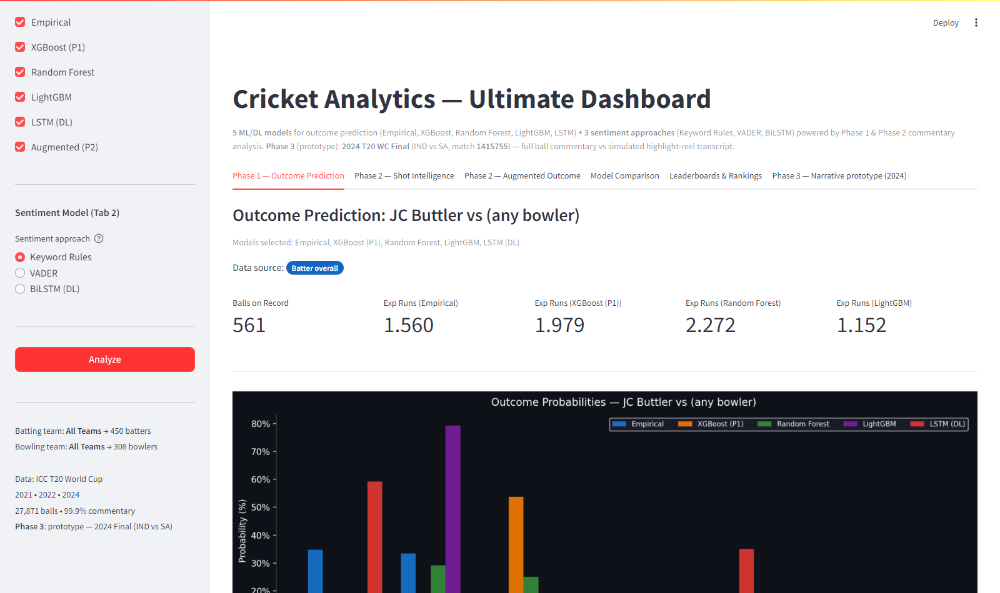
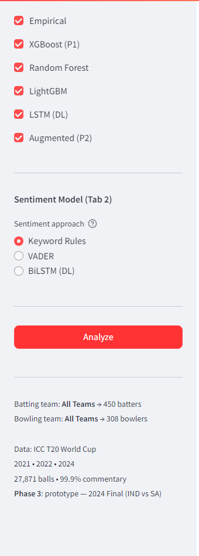
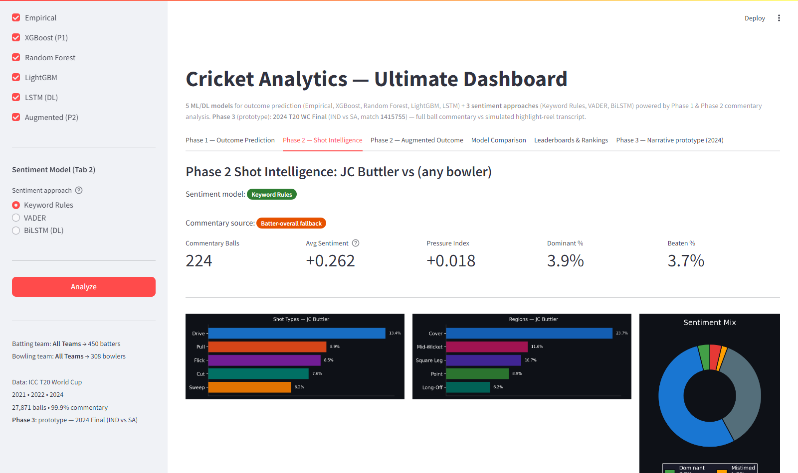
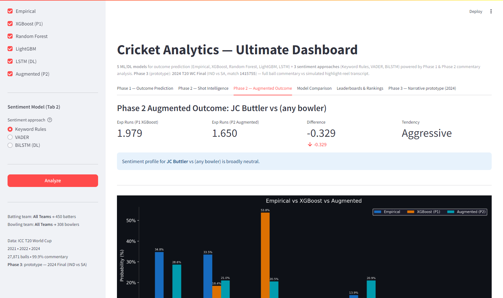
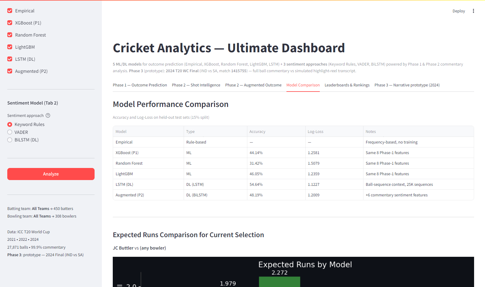
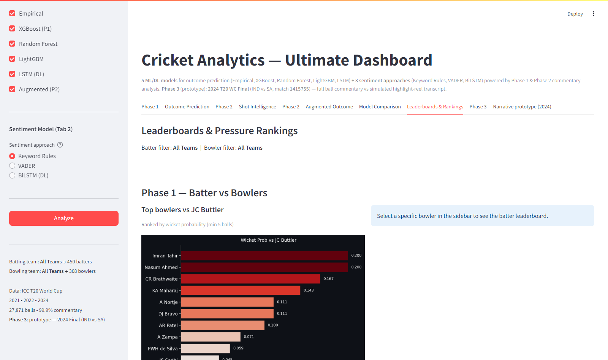
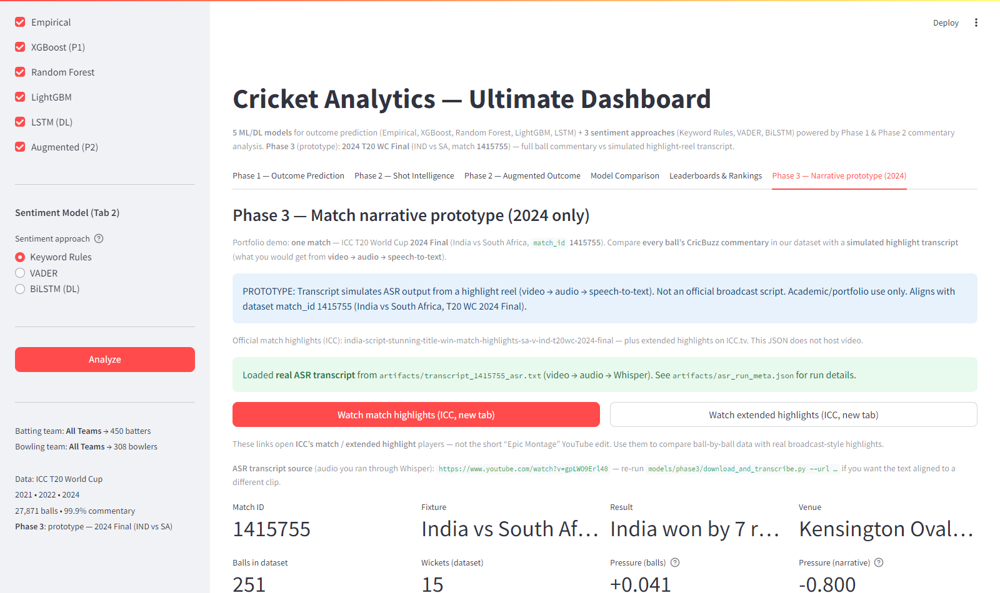

# Document 3 — UI Guide with Screenshots
## Cricket Analytics Ultimate Dashboard — Complete Walkthrough

**App URL:** run `streamlit run app.py` from `models/ultimate_model/` (default port often **8501**; use whatever URL Streamlit prints).

This document walks through every part of the Ultimate Dashboard — every tab, every widget, every number explained with annotated screenshots.

---

## Table of Contents

1. [App Overview — First Load](#1-app-overview)
2. [The Sidebar — Controls and Selection](#2-the-sidebar)
3. [Tab 1 — Phase 1: Outcome Prediction](#3-tab-1-outcome-prediction)
4. [Tab 2 — Phase 2: Shot Intelligence](#4-tab-2-shot-intelligence)
5. [Tab 3 — Phase 2: Augmented Outcome](#5-tab-3-augmented-outcome)
6. [Tab 4 — Model Comparison](#6-tab-4-model-comparison)
7. [Tab 5 — Leaderboards & Rankings](#7-tab-5-leaderboards)
8. [Tab 6 — Phase 3: Narrative Prototype (2024)](#8-tab-6--phase-3-narrative-prototype-2024)
9. [Team Filtering Feature](#9-team-filtering)
10. [Sentiment Model Toggle](#10-sentiment-model-toggle)

---

## 1. App Overview

### What you see on first load



When the app opens you see:

| Element | Location | What it means |
|---|---|---|
| **"Cricket Analytics — Ultimate Dashboard"** | Top centre | App title |
| **Subtitle line** | Below title | Confirms: 5 outcome models + 3 sentiment approaches + **Phase 3** narrative prototype (2024 final) |
| **6 tabs** | Below subtitle | Phase 1, Phase 2 Shot, Phase 2 Augmented, Model Comparison, Leaderboards, **Phase 3 Narrative** |
| **Wide main layout** | Main column | CSS widens the right-hand content (up to ~1800px) for charts |
| **"Outcome Prediction: JC Buttler vs (any bowler)"** | Main area | Default selection — JC Buttler, no specific bowler |
| **"Models selected: Empirical, XGBoost (P1), Random Forest, LightGBM, LSTM (DL)"** | Below heading | Confirms which models are active |
| **Data source: Batter overall** (orange badge) | Below models | Shows data quality — no specific bowler selected |
| **4 metric cards** | Row of numbers | Key prediction metrics per model |
| **Bar chart (dark background)** | Lower main area | 5-bar grouped chart per outcome (one bar per model) |
| **Sidebar** | Left panel | All player selection and model controls |

**The default batter is JC Buttler with no specific bowler** — so predictions are based on Buttler's overall career stats against all bowlers.

---

## 2. The Sidebar

### Full sidebar with model controls



The sidebar header shows **Cricket Analytics** and **Phase 1 + Phase 2 + Phase 3 — Ultimate Dashboard**.

The sidebar has **three main control sections**:

### Section A — Batter Selection
```
Batting Team: [All Teams ▾]     ← dropdown: filter batter list by country
Select Batter: [JC Buttler ▾]   ← dropdown: choose the batter
```

**How to use:**
1. Select "Batting Team" to filter the batter list to players from one country only
   - Example: Select "England" → only England batters appear in "Select Batter"
   - 22 teams available (all ICC T20 WC 2021-2024 teams)
2. Then select the specific batter from the filtered list

### Section B — Bowler Selection
```
Bowling Team: [All Teams ▾]         ← dropdown: filter bowler list by country
Select Bowler (optional): [(Any / Overall) ▾]   ← dropdown
```

**How to use:**
- Select "(Any / Overall)" → predictions based on batter's overall stats vs all bowlers
- Select a specific bowler → predictions specific to THAT batter vs THAT bowler matchup
- "Bowling Team" filter narrows the bowler dropdown to players from one country

**Batting Team and Bowling Team filters are independent** — you can select India's batter vs Australia's bowler with no conflict.

### Section C — Model Controls
```
Outcome Models:
[✓] Empirical         ← frequency-based statistical model
[✓] XGBoost (P1)      ← Phase 1 gradient boosting
[✓] Random Forest     ← ensemble tree model
[✓] LightGBM          ← fast gradient boosting
[✓] LSTM (DL)         ← deep learning sequence model
[✓] Augmented (P2)    ← Phase 2 XGBoost with sentiment

Sentiment Model (Tab 2):
(●) Keyword Rules      ← rule-based cricket keyword parsing
( ) VADER              ← general NLP sentiment
( ) BiLSTM (DL)        ← trained deep learning sentiment
```

**Model checkboxes:** Uncheck any model to remove it from Tab 1's bar chart and table. Useful for a cleaner comparison (e.g., uncheck RF and Empirical to just compare ML models).

**Sentiment radio:** Changes which sentiment approach is used in **Tab 2 (Shot Intelligence)** to compute the Dominant%, Beaten%, Pressure Index, and the sentiment donut chart.

### Analyze Button
```
[        Analyze        ]   ← big red button
```
Click this after changing any selection to run predictions with the new inputs. Results also update automatically when you change batter/bowler/models.

### Status Footer
```
Batting team: All Teams → 450 batters
Bowling team: All Teams → 308 bowlers
Data: ICC T20 World Cup
2021 • 2022 • 2024
27,871 balls • 99.9% commentary
Phase 3: prototype — 2024 Final (IND vs SA)
```
Tells you how many players are currently available given the team filter, confirms the data scope, and reminds you that **Phase 3** uses one fixed 2024 final (`match_id` 1415755).

---

## 3. Tab 1 — Phase 1: Outcome Prediction


This is the primary analysis tab. It shows all selected models' predictions side by side for the chosen batter vs bowler matchup.

### Header Section
```
Outcome Prediction: JC Buttler vs (any bowler)
Models selected: Empirical, XGBoost (P1), Random Forest, LightGBM, LSTM (DL)
Data source: [Batter overall] ← orange badge
```

**Data source badges:**

| Badge colour | Text | Meaning |
|---|---|---|
| Green | Direct matchup | ≥10 balls of head-to-head data — most accurate |
| Orange | Blended | 1–9 balls, blended 30% matchup + 70% overall |
| Red | Fallback — batter overall | No matchup data — uses career stats only |
| Blue | Batter overall | Overall stats (when no bowler selected) |
| Purple | ML model | XGBoost/RF/LGBM fallback label |

### Metric Cards Row
```
Balls on Record: 561
Exp Runs (Empirical): 1.560
Exp Runs (XGBoost P1): 1.979
Exp Runs (Random Forest): 2.272
Exp Runs (LightGBM): 1.152
```

- **Balls on Record:** How many balls of data are in the empirical matchup (or batter's overall career balls)
- **Exp Runs per model:** Expected runs per ball = sum(outcome × probability) for outcomes 0,1,2,3,4,6 (Wicket = 0 runs contribution)

**Why do models give different expected runs?**
Each model has different internal weights for boundary probability. RF with balanced class weights predicts boundaries more often → higher ER. LSTM with sequence context may suppress boundaries in certain contexts → lower ER.

### The Bar Chart

The central chart shows a **grouped bar chart** — one group per outcome (0 runs, 1 run, 2 runs, 3 runs, 4 runs, 6 runs, Wicket), and within each group, one bar per model.

**Bar colours:**
- Blue bar: Empirical
- Orange bar: XGBoost (P1)
- Green bar: Random Forest
- Purple bar: LightGBM
- Red bar: LSTM (DL)

**How to read it:**
- The tallest bar in the "0 runs" group → which model thinks dot balls are most likely
- If the green (RF) bar in "4 runs" is tall → Random Forest predicts boundaries more often than other models
- If the red (LSTM) bar in "W" is short → LSTM gives low wicket probability in this situation

### Probability Table

Below the chart is a detailed table:

| Outcome | Empirical % | XGBoost (P1) % | Random Forest % | LightGBM % | LSTM (DL) % |
|---|---|---|---|---|---|
| 0 runs | 30.7% | 28.6% | 16.4% | 28.9% | 43.8% |
| 1 run | 31.5% | 20.5% | 21.9% | 22.5% | 33.7% |
| 2 runs | 4.6% | 13.8% | 14.8% | 5.6% | 3.9% |
| ... | | | | | |

The table has **blue gradient shading** — darker blue = higher probability. Useful for quickly spotting which outcomes each model is most confident about.

---

## 4. Tab 2 — Phase 2: Shot Intelligence



This tab shows the **commentary-derived intelligence** for the selected batter vs bowler, using whichever sentiment model is selected in the sidebar.

### Header and Badges
```
Phase 2 Shot Intelligence: JC Buttler vs (any bowler)
Sentiment model: [Keyword Rules]    ← green badge (changes per sidebar selection)
Commentary source: [Batter-overall fallback]   ← orange badge
```

**Commentary source badges:**
- Green "Direct pair data" → uses data from the specific batter-bowler matchup's commentary
- Orange "Batter-overall fallback" → not enough pair commentary, uses batter's overall commentary vs all bowlers

### Metric Cards (5 cards)
```
Commentary Balls: 224
Avg Sentiment: +0.262
Pressure Index: +0.018
Dominant %: 3.9%
Beaten %: 3.7%
```

**What each means:**

| Metric | Range | Interpretation |
|---|---|---|
| Commentary Balls | Integer | Number of deliveries with parsed commentary |
| Avg Sentiment | -1.0 to +1.0 | Average score across all balls. Positive = more dominant, negative = more pressure |
| Pressure Index | Any float | beaten% + mistimed% - dominant%. Higher = more pressure on batter |
| Dominant % | 0–100% | Percentage of balls where batter was described as dominant (FOUR, SIX, smashed, etc.) |
| Beaten % | 0–100% | Percentage of balls where batter was beaten or missed completely |

**For JC Buttler overall:**
- Avg Sentiment +0.262 → slightly positive (in control on average)
- Pressure Index +0.018 → very slight pressure (nearly balanced)
- Low Dominant% and Beaten% suggest a controlled, conservative batting style

### Three Chart Panels

**Left panel — Shot Types bar chart:**
```
Drive  ──────────────────── 53.6%
Pull   ──────────── 9.0%
Flick  ────────── 8.1%
Cut    ─────── 7.6%
Sweep  ─── 3.7%
```
Shows what percentage of commentary-tagged balls involved each shot type. Longer bar = more frequently used shot.

**Middle panel — Regions bar chart:**
```
Cover      ────────────────────── 25.7%
Mid-Wicket ──────────── 11.0%
Square Leg ──────── 10.1%
Point      ──── 4.5%
Long-Off   ─── 4.7%
```
Shows where the batter tends to hit the ball. Useful for fielding placement analysis.

**Right panel — Sentiment Donut chart:**
The donut shows the proportion of balls tagged with each sentiment label:
- Green segment: DOMINANT
- Blue segment: CONTROLLED
- Dark grey: DEFENSIVE
- Yellow: MISTIMED
- Red: BEATEN

A large blue/green segment = batter in control.
A large red/yellow segment = batter under pressure.

### Full Sentiment Breakdown Table

Below the charts, a detailed table appears:

| Signal | Value | Meaning |
|---|---|---|
| Dominant | 3.9% | Boundaries and big shots — batter in control |
| Controlled | 54.0% | Timed singles/doubles — batter comfortable |
| Defensive | 36.5% | Blocked/played out — safe but passive |
| Mistimed | 1.9% | Top/leading edges — not timing well |
| Beaten | 3.7% | Beaten / missed completely |
| Boundary Hit | 13.8% | Actual boundary rate in commentary balls |
| Dot Ball | 30.4% | Actual dot ball rate |
| Pressure Index | +0.018 | beaten% + mistimed% - dominant% |

---

### Switching Sentiment Model (VADER or BiLSTM)

Change the radio button in the sidebar under "Sentiment Model (Tab 2)":

**With VADER selected:** The Avg Sentiment, Pressure Index, and donut chart recalculate using VADER's lexicon-based scoring. VADER tends to be more positive on cricket text than keyword rules because boundary commentary often has celebratory language VADER recognises.

**With BiLSTM selected:** The full commentary text is run through the trained BiLSTM model in real time. This may take 2–5 seconds for large batter/bowler combinations. The BiLSTM's learned patterns often produce more nuanced sentiment distributions than keyword rules.

**A comparison table appears (VADER/BiLSTM only):** When a non-keyword model is selected, a table appears comparing Keyword Rules % vs the selected model % for each sentiment class.

---

## 5. Tab 3 — Phase 2: Augmented Outcome



This tab shows the **Augmented XGBoost** model's predictions — the model that adds 6 commentary sentiment features to the 8 Phase 1 features.

### Metric Cards (4 cards)
```
Exp Runs (P1 XGBoost): 1.979
Exp Runs (P2 Augmented): 1.650
Difference: -0.329 ↓ (shown in red)
Tendency: Aggressive
```

- **P1 XGBoost expected runs:** Prediction from Phase 1 model (8 features)
- **P2 Augmented expected runs:** Prediction from Phase 2 model (14 features, including sentiment)
- **Difference:** How much the sentiment features changed the prediction. Negative = Phase 2 thinks fewer runs than Phase 1. Positive = Phase 2 is more optimistic.
- **Tendency:** Batter tendency (Aggressive SR≥140 / Balanced SR≥100 / Defensive SR<100)

### Sentiment Context Box
```
"Sentiment profile for JC Buttler vs (any bowler) is broadly neutral."
```
This box shows one of three messages:
- "Batter is in dominant form" → sentiment score >0.3 and dominant% >5%
- "Batter is under pressure" → pressure index >0.05 and beaten% >5%
- "Broadly neutral" → neither extreme

### Three-Way Bar Chart
Shows Empirical vs XGBoost (P1) vs Augmented (P2) side by side:

```
0 runs:  Empirical 36.8%  XGBoost 28.6%  Augmented 22.5%
1 run:   Empirical 26.6%  XGBoost 20.5%  Augmented 13.5%
4 runs:  Empirical 13.9%  XGBoost 20.3%  Augmented 21.9%
...
```

**Reading the chart:** Where Augmented % diverges from XGBoost %, the sentiment features are having an effect. For JC Buttler overall, the Augmented model predicts fewer dots and 1-runs (less conservative) but similar boundary rate — reflecting that commentary describes him as an aggressive player even when not hitting boundaries.

### Full Probability Comparison Table

| Outcome | Empirical % | P1 XGBoost % | P2 Augmented % | P2 vs P1 diff |
|---|---|---|---|---|
| 0 runs | 36.8% | 28.6% | 22.5% | -6.1% (red) |
| 1 run | 26.6% | 20.5% | 13.5% | -7.0% (red) |
| 4 runs | 13.9% | 20.3% | 21.9% | +1.6% (green) |

Diff column: green = Augmented predicts higher probability, red = lower probability.

### Phase 2 Model Improvement Expander
Click to expand and see:
```
| Model      | Accuracy | Log-Loss |
| Baseline   | 43.77%   | 1.2581   |
| Augmented  | 48.19%   | 1.2009   |
| Improvement| +4.43%   | -0.057   |
```
Plus an explanation of the 6 sentiment features and feature importance rankings.

---

## 6. Tab 4 — Model Comparison



This tab is the **technical scorecard** — all models compared on accuracy, loss, and expected runs for the current selection.

### Model Performance Table

| Model | Type | Accuracy | Log-Loss | Notes |
|---|---|---|---|---|
| Empirical | Rule-based | — | — | Frequency-based, no training |
| XGBoost (P1) | ML | 44.14% | 1.2581 | Same 8 Phase-1 features |
| Random Forest | ML | 31.42% | 1.5079 | Same 8 Phase-1 features |
| LightGBM | ML | 46.05% | 1.2359 | Same 8 Phase-1 features |
| LSTM (DL) | DL (LSTM) | **54.64%** | **1.1227** | Ball-sequence context, 25K sequences |
| Augmented (P2) | DL (BiLSTM) | 48.19% | 1.2009 | +6 commentary sentiment features |

**What the columns mean:**
- **Type:** Rule-based = no training; ML = traditional machine learning; DL = deep learning neural network
- **Accuracy:** Percentage of test set balls where the model predicted the correct outcome class. Higher is better.
- **Log-Loss:** Measures how well-calibrated the probability estimates are. Lower is better. A model with low log-loss gives confident probabilities for outcomes that actually happen.
- **Notes:** Key architectural detail

### Expected Runs Comparison Bar Chart

A bar chart below the table shows the **Expected Runs per ball** for the current selection (JC Buttler vs any bowler) from each model:

```
Empirical:    1.560
XGBoost (P1): 1.979
Random Forest: 2.272   ← highest (balanced class weights)
LightGBM:     1.152   ← lowest
LSTM:         1.401
Augmented P2: 1.650
```

The chart makes it visually clear which models are bullish vs bearish for this batter, useful for identifying systematic biases per model.

### Sentiment Approach Comparison Table

| Model | Type | Accuracy | Vocab | Speed | Key Advantage |
|---|---|---|---|---|---|
| Keyword Rules | Rule-based | Ground truth | ~80 patterns | Instant | Cricket-specific, interpretable |
| VADER | Rule-based NLP | 18.8% vs keywords | General English | Instant | No training, standard NLP |
| BiLSTM (DL) | Deep Learning | 96.8% vs keywords | 5,000 commentary words | ~1s per batch | Generalises beyond keyword list |

**Important note:** The "Accuracy" for sentiment models is measured **against keyword rules** (which are used as ground truth), not against an external gold standard.

---

## 7. Tab 5 — Leaderboards & Rankings



This tab shows two types of rankings:

### Phase 1 — Batter vs Bowlers (top section)

**Left column: "Top bowlers vs [selected batter]"**

A horizontal bar chart ranked by **wicket probability** — which bowlers have historically taken the current batter's wicket most often:

```
Top bowlers vs JC Buttler (wicket probability):
Imran Tahir     ──────────────────── 0.200
Nasum Ahmed     ──────────────────── 0.200
CR Brathwaite   ────────────── 0.167
KA Maharaj      ─────────── 0.143
A Nortje        ──────── 0.111
DJ Bravo        ──────── 0.111
...
```

Caption: "Ranked by wicket probability (min 5 balls)"

**Right column: "Top batters vs [selected bowler]"**

Only appears when a specific bowler is selected. Shows which batters score most freely against that bowler, ranked by expected runs per ball.

### Phase 2 — Pressure Rankings (bottom section)

**Left column: "Most pressured batters"**

Batters ranked by average pressure index across all their matchups (minimum 20 commentary balls):

```
Pressure Index (Batters):
[batter names ranked by avg_pressure_index]
Positive values → under more pressure from bowlers
Negative values → tend to dominate bowlers
```

**Right column: "Bowlers creating most pressure"**

Bowlers ranked by how much pressure they create across all their matchups:

```
Pressure Index (Bowlers):
[bowler names ranked by avg_pressure_index they impose]
Higher = better at pressuring batters
```

### Using the Team Filters with Leaderboards

The team filters in the sidebar (Batting Team / Bowling Team) also affect the leaderboards:
- Batting Team filter narrows "Top batters vs [bowler]" to players from that team
- Bowling Team filter narrows "Top bowlers vs [batter]" to players from that team
- Pressure Rankings: batting team filter applies to batter rankings, bowling team filter to bowler rankings

---

## 8. Tab 6 — Phase 3: Narrative prototype (2024)



**Phase 3** is a **portfolio prototype**: one match only — **ICC Men’s T20 World Cup 2024 Final**, **India vs South Africa** (`match_id` **1415755**). It does **not** use the sidebar batter/bowler selection.

### What it compares

| Source | What it is |
|--------|------------|
| **Ball commentary (blue bars / left donut)** | Every CricBuzz commentary ball in the dataset for that match — same **keyword sentiment rules** as Phase 2 |
| **Highlight narrative (red bars / right donut)** | Text from **video → audio → Whisper (ASR)** on a YouTube **match highlights** clip, *or* the JSON fallback if no ASR file is present |

When `models/phase3/artifacts/transcript_1415755_asr.txt` exists, a green banner confirms **real ASR** is loaded; `asr_run_meta.json` records the exact `source_url` used.

### ICC watch buttons (new tab)

Two **link buttons** open official ICC pages (not embedded video):

- **Match highlights** — ICC.tv match highlights player for IND vs SA Final  
- **Extended highlights** — longer ICC package for the same final  

Use these for **broadcast-style** viewing; ASR uses a downloadable YouTube highlights reel for the pipeline.

### Charts and metrics

- **Grouped bar chart** — sentiment mix (% Dominant, Controlled, Defensive, Mistimed, Beaten) for **balls vs narrative sentences**  
- **Two donuts** — same comparison visually  
- **Pressure Index** — `beaten + mistimed − dominant` for both sides  
- **Expander** — full ASR transcript (or placeholder text)

### Pipeline scripts (offline)

- `models/phase3/download_and_transcribe.py` — `yt-dlp` → `ffmpeg` → **OpenAI Whisper** → updates transcript + `asr_run_meta.json`  
- Media files live under `models/phase3/media/` (gitignored); small text artifacts stay in `artifacts/`

---

## 9. Team Filtering Feature

The team filters are the most powerful selection tool in the sidebar.

**Example — Finding India vs Australia matchup analysis:**

1. Under "Batter" section → set "Batting Team" to **India**
   - The "Select Batter" dropdown now shows only Indian players (e.g., V Kohli, RG Sharma, KL Rahul)
2. Under "Bowler" section → set "Bowling Team" to **Australia**
   - The "Select Bowler" dropdown now shows only Australian players (e.g., A Nortje, MA Starc, A Zampa)
3. Select batter and bowler from the filtered lists
4. Click Analyze

**All 22 teams available:**
Australia, Bangladesh, Canada, England, Hong Kong, India, Ireland, Namibia, Nepal, Netherlands, New Zealand, Oman, Pakistan, Papua New Guinea, Scotland, South Africa, Sri Lanka, Uganda, United Arab Emirates, United States of America, West Indies, Zimbabwe

**Sidebar status shows count:**
```
Batting team: India → 25 batters
Bowling team: Australia → 13 bowlers
```

**Fallback:** If a team has no players in the dataset (unlikely but possible for very minor teams), the filter falls back to showing all players.

---

## 10. Sentiment Model Toggle

The radio button under "Sentiment Model (Tab 2)" in the sidebar controls which method is used to compute sentiment in **Tab 2 only** (Shot Intelligence).

### Option 1: Keyword Rules (default)
- Uses pre-computed values from `sentiment_stats.csv`
- Instant — no additional computation at runtime
- Most accurate for cricket commentary
- The values shown in Tab 2 match exactly what was computed by `pressure_builder.py`

### Option 2: VADER
- Runs VADER's `polarity_scores()` on every commentary string for the selected batter/bowler pair in real time
- Takes 1–3 seconds depending on the number of balls
- Uses cricket-enhanced lexicon (with custom scores for "six", "four", "beaten", etc.)
- Results are noticeably different from Keyword Rules — VADER tends to see more "neutral" or misclassified balls

### Option 3: BiLSTM (DL)
- Runs the trained BiLSTM model on every commentary string for the selected pair in real time
- Takes 2–8 seconds depending on number of balls
- Most computationally expensive but also most accurate
- Produces a comparison table showing Keyword Rules % vs BiLSTM % per sentiment class

**When to use each:**
- **Keyword Rules** → everyday use, fastest, cricket-specific
- **VADER** → research comparison, see how general NLP compares
- **BiLSTM** → deeper analysis where you want the learned model's opinion, or for research/presentation purposes

---

## Quick Reference — All UI Elements

| UI Element | Location | What it controls |
|---|---|---|
| Batting Team dropdown | Sidebar | Filters batter list |
| Select Batter dropdown | Sidebar | Choose batter |
| Bowling Team dropdown | Sidebar | Filters bowler list |
| Select Bowler dropdown | Sidebar | Choose bowler (optional) |
| Empirical checkbox | Sidebar | Show/hide Empirical in Tab 1 |
| XGBoost (P1) checkbox | Sidebar | Show/hide XGBoost in Tab 1 |
| Random Forest checkbox | Sidebar | Show/hide RF in Tab 1 |
| LightGBM checkbox | Sidebar | Show/hide LightGBM in Tab 1 |
| LSTM (DL) checkbox | Sidebar | Show/hide LSTM in Tab 1 |
| Augmented (P2) checkbox | Sidebar | Show/hide Aug. in Tab 1 |
| Sentiment approach radio | Sidebar | Which sentiment method Tab 2 uses |
| Analyze button | Sidebar | Refresh all predictions |
| Status footer | Sidebar bottom | Shows player counts + data info |
| Tab 1 bar chart | Main area | 5-model probability comparison |
| Tab 1 metric cards | Main area | Expected runs per model |
| Tab 1 table | Main area | Detailed probability per outcome |
| Tab 2 metric cards | Main area | Commentary balls, sentiment, pressure |
| Tab 2 shot chart | Main area | Shot type frequency bars |
| Tab 2 region chart | Main area | Region frequency bars |
| Tab 2 donut | Main area | Sentiment proportion pie |
| Tab 2 breakdown table | Main area | Full sentiment label breakdown |
| Tab 3 cards | Main area | P1 vs P2 expected runs + diff |
| Tab 3 context box | Main area | Sentiment narrative |
| Tab 3 3-way chart | Main area | Empirical vs XGB vs Augmented |
| Tab 3 expander | Main area | Model accuracy history |
| Tab 4 accuracy table | Main area | All models accuracy + log-loss |
| Tab 4 ER bar chart | Main area | Expected runs by model |
| Tab 4 sentiment table | Main area | VADER vs BiLSTM vs Keywords |
| Tab 5 wicket chart | Main area | Top bowlers vs selected batter |
| Tab 5 runs chart | Main area | Top batters vs selected bowler |
| Tab 5 pressure charts | Main area | Pressure index rankings |
| Tab 6 Phase 3 | Main area | ICC links, ASR vs ball sentiment, donuts |
| Phase 3 transcript | Tab 6 expander | Full ASR / placeholder text |
